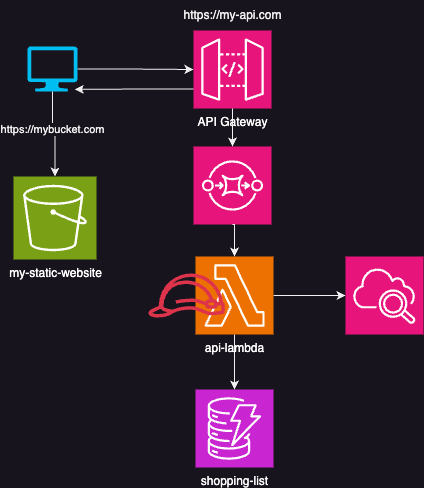

# Mein erstes API

## Allgemeine Infrastruktur

## API Dokumentation
`GET /allitems`: Gibt Alle Elemente der Shopping Liste zurück

`GET /itembyid/{itemdId}`: Gibt ein einzelnes Elemnt zurück.
**Parameter**: `itemId` - Einzigartige Id des Elements

`POST /api/items`: Erstellen eines neuen Elements

`DELETE /api/items{id}`: Löschen eines Elements

`PUT /api/items/{id}`: Aktualisierung eines Elements
